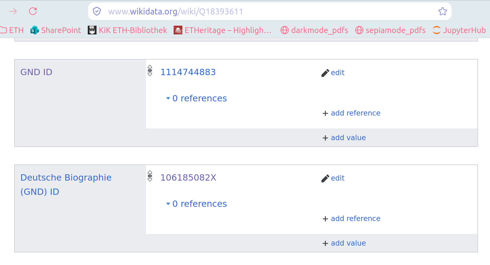

# Handling Multiple GND IDs per Wikidata Q-ID
When resolving Wikidata Q-IDs with GND-IDs, several issues can arise due to the fact that a single Wikidata entry can be associated with multiple GND-IDs. This is not always an error, but in case it is, this repo addresses it. This repo handles the following issues:

## Case 0: Old authority names
The GND database periodically merges authority records that refer to the same person. An item on Wikidata might still contain references to the old authority ID. 
### Example
https://www.wikidata.org/wiki/Q312384
### Solution
Query the lobid.org GND API. It automatically redirects you to the most recent authority id, so check for redirection
```
lobid_url = f"""https://lobid.org/gnd/{gnd_id}.json"""
req = requests.head(lobid_url, allow_redirects=False)
if req.is_redirect:
real_gnd_id = (
    req.headers["Location"].split("/")[-1].replace("?format=json", "")
)
```
## Case 1: Pseudonyms
Some people use pseudonyms for their professional lives. Since they might have two GND IDs, one for their personal life and one for their professional pseudonym, both links can be correct for a Wikidata item.
### Example
https://www.wikidata.org/wiki/Q213855
whose GND IDs are:
https://d-nb.info/gnd/118822039, https://d-nb.info/gnd/1067756124
### Solution
Would have to be individual to the use-case. You can solve it the same way as Case 2 but that might not serve your needs.

## Case 2: Incorrect or uncertain linking
### Example
https://www.wikidata.org/wiki/Q5460735
### Solution
Search via wdt: prefix, like
```
query = f"""SELECT ?gndId WHERE {{
  VALUES ?gndProp {{ wdt:P227 wdt:P7902 }}
  wd:{wikidata_id} ?gndProp ?gndId .
}}
GROUP BY ?gndId"""
```
which will give preference to the "best ranked" statement as defined by Wikidata

## Case 3: Two different references in the two GND fields
Unfortunately, Wikidata has two fields for the GND ID: P227 and P7902, if both have different GND IDs, there's no priority ordering like there is in Case 2.
### Example
https://www.wikidata.org/wiki/Q18393611

one of them (106185082X) is clearly incorrect, these we can gather and send to Wikidata or fix manually.
https://www.wikidata.org/wiki/Q94803987
### Solution
Will have to actually change the Wikidata record.

## Case 4: Possibly incorrect GND IDs
The two GND IDs might refer to the same person, but the information given is not enough to ascertain it.
### Example
https://www.wikidata.org/wiki/Q72067012
### Solution
Unfortunately, this would require some sort of deep-dive into this person or these persons in order to manually either consolidate or clearly disambiguate them.

# Contact
If you have any questions, feel free to reach out to rashitig@ethz.ch. 
